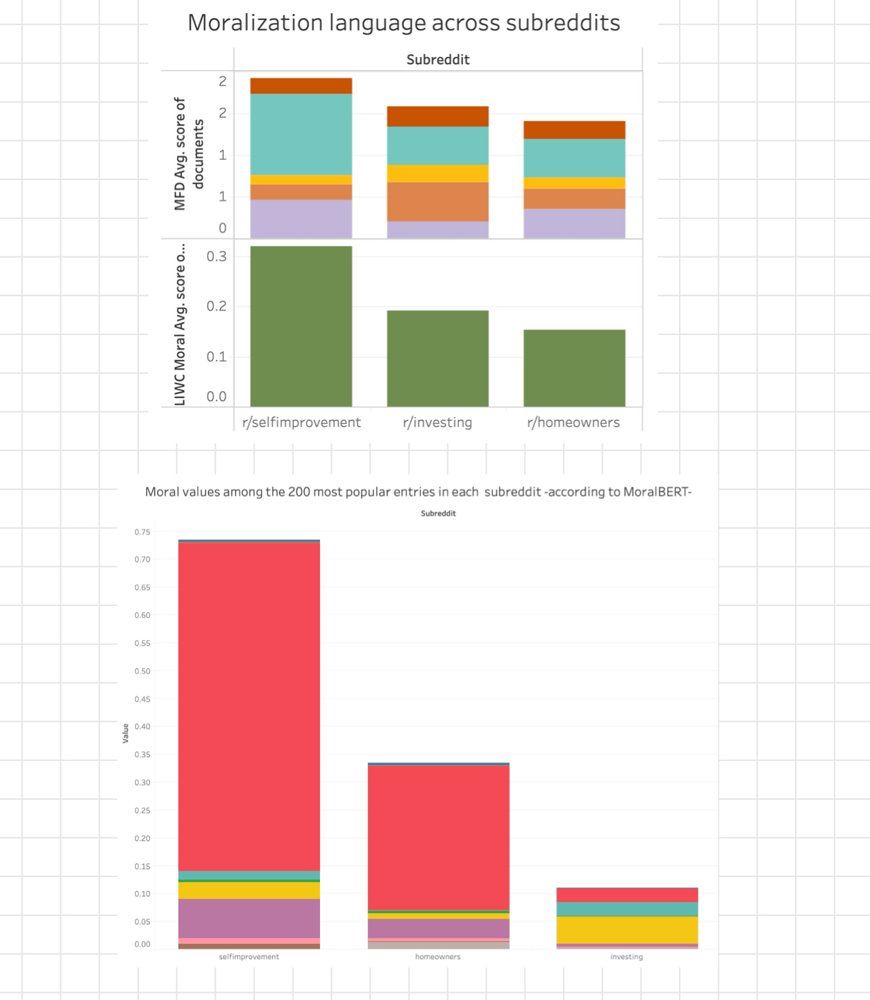
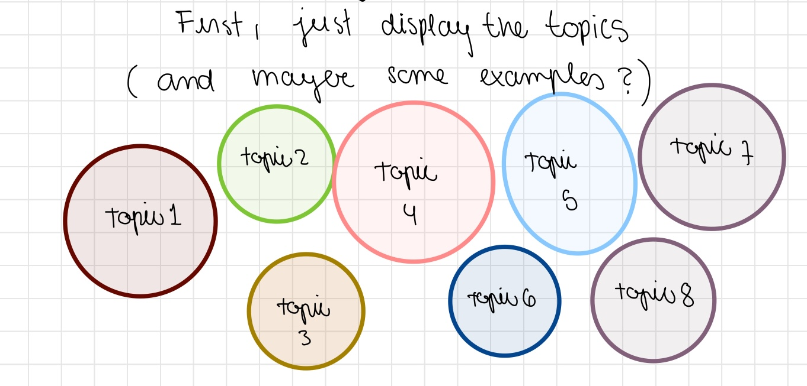

# Data Visualization - Final Project Proposal

This repository contains an updated visual portfolio proposal for exploring the topic of the moralization of self improvement. 

## Research Questions

1) To what degree is moral language present when talking about self improvement?
2) Are there some specific topics within self improvement discussions that tend to be discussed with a higher moral tone?
3) How does the usage of moral language associate with different emotions in the context of self-improvement?

## Data 

Submissions and comments from the subreddit r/selfimprovement were analyzed to obtain topics on the corpus and scores of moralization language. The data and a more detailed explanation are available in the [data folder](data).

put moralbert
and all data

## Proposal

I intend to build on the work from previous assignments and add some new plots. The final deliverable I envision is a website where the user can navigate through the three research questions and have a separate page for each of them. 

### Page 1 - To what degree is moral language present when talking about self improvement?

I plan to reuse plots from my Tableau assignment that illustrate the differences in morality scores across three subreddits. Additionally, I'll create a new plot using a new measure of morality (MoralBERT). My goal is to compare these measures and organize them effectively on the page. I'm still deciding on the best way to present them, but the aim is to demonstrate that the self-improvement subreddit consistently shows higher morality values across different measurement methods.

### Page 2 - Are there some specific topics within self improvement discussions that tend to be discussed with a higher moral tone?

[Alternative link if embedded visualization does not work](https://public.tableau.com/app/profile/natasha.carpio.castellanos/viz/topics_exploration/Dashboard1?publish=yes)

<noscript></noscript><object class='tableauViz'  style='display:none;'><param name='host_url' value='https%3A%2F%2Fpublic.tableau.com%2F' /> <param name='embed_code_version' value='3' /> <param name='site_root' value='' /><param name='name' value='topics_exploration&#47;Dashboard1' /><param name='tabs' value='no' /><param name='toolbar' value='yes' /><param name='static_image' value='https:&#47;&#47;public.tableau.com&#47;static&#47;images&#47;to&#47;topics_exploration&#47;Dashboard1&#47;1.png' /> <param name='animate_transition' value='yes' /><param name='display_static_image' value='yes' /><param name='display_spinner' value='yes' /><param name='display_overlay' value='yes' /><param name='display_count' value='yes' /><param name='language' value='en-US' /><param name='filter' value='publish=yes' /></object>
                

Although my initial proposal suggested using bar plots to show the distribution of topics, I now feel I already have too many bar plots. This is one area where I can sacrifice some information and use something more visually engaging. I propose using bubble charts which don't allow for a perfect comparison, but give a general sense of what the topics are and their approximate proportions, with the option for users to hover over each bubble to see the total percentage of the corpus (and possibly see some example documents). This is a point of entry to the idea of topics. 

Below that plot, I want to create an interactive graph that allows users to explore different moral dimensions. The idea is to let them switch from one dimension to another and see how various topics score in each. For instance, you can see an example of the sanctity dimension above, but the goal is for users to move seamlessly across all dimensions and see similar plots.

### Page 3 - How does the usage of moral language associate with different emotions in the context of self-improvement?

For this question, I want to reuse the plot from Assignment 3, which illustrates that moral language isn't directly related to negative emotion. Instead, the topics themselves are what relate to the emotional tone of the content. 

Additionally, I plan to expand on this by adding a new plot for each topic, where the user can visualize the connotation of words based on their positive and negative emotion scores on the x and y axes. The goal is to show which words are predominantly used in positive contexts versus negative ones. This will provide a nuanced overview of the specific words used in moral language and how they vary across topics. Users will be able to move from topic to topic and explore the top 10-20 moral words used in each topic and their emotional connotations.

